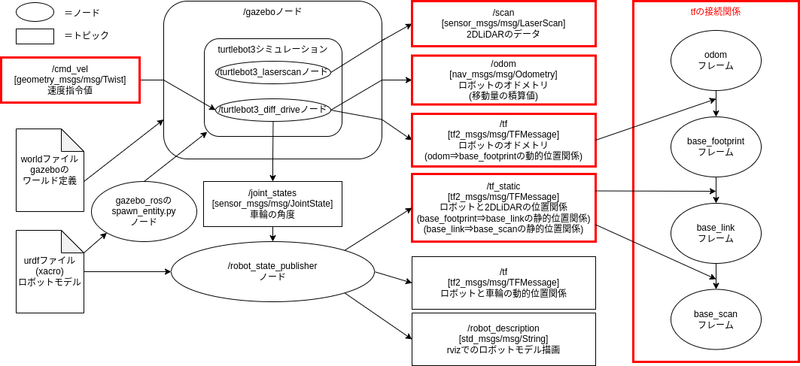

# ROS2 Humble
実行するには各種インストール方法の③でROS2Humbleの環境を作るか、ROS2Galacticにして以下の出てくるhumbleを読み替えて実行してください。
## Gazeboをlaunchで起動する
サンプルのlaunchファイルは、`gazebo_rosパッケージ`内に`gzserver.launch.py`と`gzclient.launch.py`があります。
`gzserver`がワールドを立ち上げるので、worldファイルを読み込ませるのは、`gzserver`になります。
```sh
ros2 launch gazebo_ros gzserver.launch.py world:=worldファイルのパス
```

GUIが必要な場合は、`gzclient`を起動します。
```sh
ros2 launch gazebo_ros gzclient.launch.py
```

---

### gazebo_launch.py
上記のlaunchをまとめたlaunchは下記になります。
```python
#!/usr/bin/env python3
# coding:utf-8
import os

from ament_index_python.packages import get_package_share_directory
from launch import LaunchDescription
from launch.actions import IncludeLaunchDescription
from launch.launch_description_sources import PythonLaunchDescriptionSource

def generate_launch_description():
    pkg_gazebo_ros = get_package_share_directory('gazebo_ros')
    world = os.path.join(
        get_package_share_directory('my_nav2_bringup'),
        'worlds',
        'willowgarage.world'
    )
    gzserver_cmd = IncludeLaunchDescription(
        PythonLaunchDescriptionSource(
            os.path.join(pkg_gazebo_ros, 'launch', 'gzserver.launch.py')
        ),
        launch_arguments={'world': world}.items()
    )
    gzclient_cmd = IncludeLaunchDescription(
        PythonLaunchDescriptionSource(
            os.path.join(pkg_gazebo_ros, 'launch', 'gzclient.launch.py')
        )
    )

    ld = LaunchDescription()
    ld.add_action(gzserver_cmd)
    ld.add_action(gzclient_cmd)
    return ld
```

---

## 4. ロボットをシミュレーションする(turtlebot3)


次にGazeboでロボットをシミュレーションしてみます。

- ROS2の自律走行メタパッケージ`navigation2(nav2)`のチュートリアルではROBOTIS社のturtlebot3というロボットが使用されています。
- turtlebot3ではgazeboのモデルが用意されているためこれを使ってロボットをシミュレーションしてみましょう。
- turtlebot3には3種類のモデルがありますが、今回はwaffleを使用します。

---

### Turtlebot3の関連サイト
- [turtlebot](https://www.turtlebot.com/)
- [ROBOTIS e-Manual: turtlebot3/Quick Start Guide](https://emanual.robotis.com/docs/en/platform/turtlebot3/quick-start/)
- [ROBOTIS e-Manual: turtlebot3/Simulation](https://emanual.robotis.com/docs/en/platform/turtlebot3/simulation/)


---

### turtlebot3のシミュレーション環境のインストール
```sh
# aptでturtlebot3のシミュレーションとnav2関連のインストール
sudo apt -y install ros-humble-gazebo-* ros-humble-cartographer ros-humble-cartographer-ros ros-humble-navigation2 ros-humble-nav2-bringup
sudo apt -y install ros-humble-dynamixel-sdk ros-humble-turtlebot3-msgs ros-humble-turtlebot3 ros-humble-turtlebot3-simulations
# ~/.bashrcにTURTLEBOT3の使用するモデルを選択する設定を追加(端末起動に読み込まれる)(burger,waffle,waffle_piから選択可能)
echo "export TURTLEBOT3_MODEL=waffle" >> ~/.bashrc
# ~/.bashrcにTURTLEBOT3のシミュレーションモデルをGazeboに読み込む設定を追加(端末起動に読み込まれる)
echo "export GAZEBO_MODEL_PATH=$GAZEBO_MODEL_PATH:/opt/ros/humble/share/turtlebot3_gazebo/models" >> ~/.bashrc
```

---

### turtlebot3のシミュレーションの起動
- turtlebot3関連のパッケージはたくさんありますが、シミュレーションを行うパッケージは、`turtlebot3_gazebo`になります。
- Gazeboのworld環境は下記が用意されています。
    - empty_world.world (何もない)
    - turtlebot3_world.world (正六角形の中に1m間隔で9個の円柱)
    - turtlebot3_house.world (模擬住宅環境)
    - turtlebot3_dqn_stage1.world (5m四方の枠)
    - turtlebot3_dqn_stage2.world (5m四方の枠と4個の円柱)
    - turtlebot3_dqn_stage3.world (5m四方の枠と4個の円柱)
    - turtlebot3_dqn_stage4.world (5m四方の枠内に壁が設置)

- 今回は`empty_world.world`を使用するため、launchコマンドで`empty_world.launch.py`を呼び出します。
```sh
ros2 launch turtlebot3_gazebo empty_world.launch.py
# teleop_twist_keyboardで速度指令値を送信し動かしてみる
ros2 run teleop_twist_keyboard teleop_twist_keyboard
```
- Gazeboが起動し、turtlebot3のwaffleモデルが表示されます。
- turtlebot3のwaffleモデルは`/cmd_velトピック`で動作する差動2輪駆動型のロボットになるため、筐体の横に円柱のタイヤが2個ついています。
- 青い円のように見えているものがLaserScanシミュレーション、白い三角柱のように見えているものがカメラシミュレーションになります。


---

### `turtlebot3_gazebo`の`empty_world.launch.py`の詳細
```python title="empty_world.launch.py" linenums="1"
import os

from ament_index_python.packages import get_package_share_directory
from launch import LaunchDescription
from launch.actions import IncludeLaunchDescription
from launch.launch_description_sources import PythonLaunchDescriptionSource
from launch.substitutions import LaunchConfiguration


def generate_launch_description():
    launch_file_dir = os.path.join(get_package_share_directory('turtlebot3_gazebo'), 'launch')
    pkg_gazebo_ros = get_package_share_directory('gazebo_ros')

    use_sim_time = LaunchConfiguration('use_sim_time', default='true')
    x_pose = LaunchConfiguration('x_pose', default='0.0')
    y_pose = LaunchConfiguration('y_pose', default='0.0')

    world = os.path.join(
        get_package_share_directory('turtlebot3_gazebo'),
        'worlds',
        'empty_world.world'
    )

    gzserver_cmd = IncludeLaunchDescription(
        PythonLaunchDescriptionSource(
            os.path.join(pkg_gazebo_ros, 'launch', 'gzserver.launch.py')
        ),
        launch_arguments={'world': world}.items()
    )

    gzclient_cmd = IncludeLaunchDescription(
        PythonLaunchDescriptionSource(
            os.path.join(pkg_gazebo_ros, 'launch', 'gzclient.launch.py')
        )
    )

    robot_state_publisher_cmd = IncludeLaunchDescription(
        PythonLaunchDescriptionSource(
            os.path.join(launch_file_dir, 'robot_state_publisher.launch.py')
        ),
        launch_arguments={'use_sim_time': use_sim_time}.items()
    )

    spawn_turtlebot_cmd = IncludeLaunchDescription(
        PythonLaunchDescriptionSource(
            os.path.join(launch_file_dir, 'spawn_turtlebot3.launch.py')
        ),
        launch_arguments={
            'x_pose': x_pose,
            'y_pose': y_pose
        }.items()
    )

    ld = LaunchDescription()

    # Add the commands to the launch description
    ld.add_action(gzserver_cmd)
    ld.add_action(gzclient_cmd)
    ld.add_action(robot_state_publisher_cmd)
    ld.add_action(spawn_turtlebot_cmd)

    return ld
```


- `empty_world.launch.py`では、`gzserver`,`gzclient`の他に以下の2個のlaunchファイルを呼び出し、2個のノードを起動しています。
  - `robot_state_publisher.launch.py`
    - パッケージ名:`robot_state_publisher`
    - ノード名:`robot_state_publisher`
    - urdfファイル読込、静的位置関係の`/tf_staticトピック`とrviz上にロボットモデルを表示するための`/robot_descriptionトピック`を出力
    - `/joint_statesトピック`(今回はタイヤの回転状態)をサブスクライブし動的位置関係の`/tfトピック`を出力
    - urdfファイルパス:`/opt/ros/humble/share/turtlebot3_gazebo/urdf/turtlebot3_waffle.urdf`
  - `spawn_turtlebot3.launch.py`
    - パッケージ名:`gazebo`
    - ノード名:`spawn_entity.py`
    - sdfファイル(urdfファイル)を読込、gazebo上にturtlebot3のwaffleモデルを配置し、ノードを終了
    - sdfファイルパス:`/opt/ros/humble/share/turtlebot3_gazebo/models/turtlebot3_waffle/model.sdf`
- turtlebot3のwaffleモデルには、筐体モデルの他に差動2輪制御コントローラや複数のセンサシミュレーションのgazebo_pluginsが記述され、ROS2ノードとして動作しています。(`ros2 node list`で確認できます)
  - 差動2輪制御コントローラ
    - ノード名:`/turtlebot3_diff_drive`
    - gazeboプラグイン名:`libgazebo_ros_diff_drive.so`
  - 車輪の回転状態シミュレーション
    - ノード名:`/turtlebot3_joint_state`
    - gazeboプラグイン名:`libgazebo_ros_joint_state_publisher.so`
  - 2DLiDARシミュレーション
    - ノード名:`/turtlebot3_laserscan`
    - gazeboプラグイン名:`libgazebo_ros_ray_sensor.so`
  - カメラシミュレーション
    - ノード名:`/camera_driver`
    - gazeboプラグイン名:`libgazebo_ros_camera.so`
  - IMUシミュレーション
    - ノード名:`/turtlebot3_imu`
    - gazeboプラグイン名:`libgazebo_ros_imu_sensor.so`
- gazeboプラグインの種類に関してはgazeboのチュートリアルページやgazebo_pluginsのgithubの実装で確認できます。
  - [gazeboのチュートリアルページ](https://classic.gazebosim.org/tutorials?cat=connect_ros)
  - [gazebo_ros_pkgsのgazebo_plugins](https://github.com/ros-simulation/gazebo_ros_pkgs/tree/galactic/gazebo_plugins/src)

---


### turtlebot3のシミュレーションのノード構成
現在の状態は下記の図のようになります。(講習会ではあまり使用しないためカメラとIMUのシミュレーションは図から省略しています)



- 図の赤枠部分が自律走行を行っていく上で重要な部分になります。
- 入力部分(サブスクライバ)は`/cmd_velトピック`となっているため、【1章】で行った速度指令値出力で動かすことができます。

```sh
# ros2 topic pubコマンドの場合
ros2 topic pub --once /cmd_vel geometry_msgs/msg/Twist "{linear: {x: 0.25, y: 0.0, z: 0.0}, angular: {x: 0.0, y: 0.0, z: 0.5}}"

# teleop_twist_keyboardの場合
ros2 run teleop_twist_keyboard teleop_twist_keyboard 

# joy + teleop_twist_joyの場合
ros2 run joy joy_node
ros2 run teleop_twist_joy teleop_node 
```

---