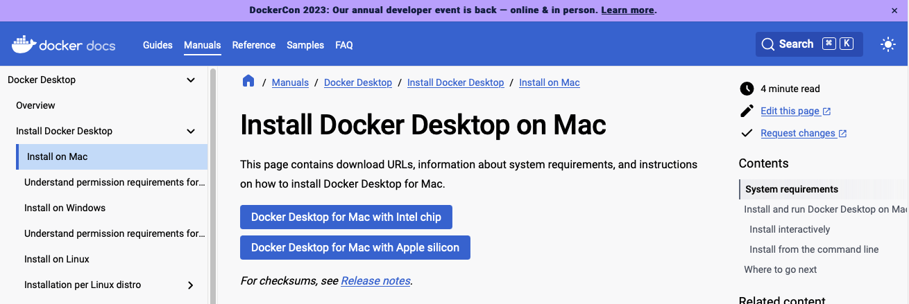
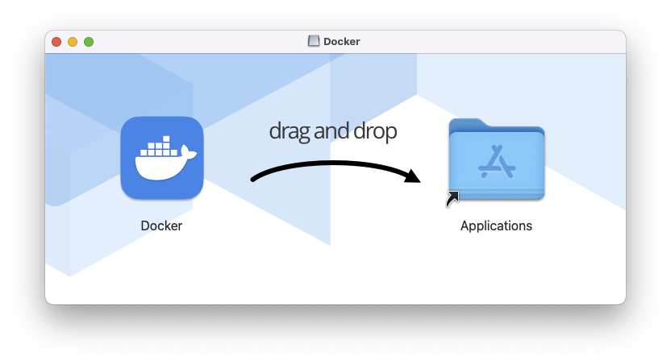

# macOSのDocker上のUbuntuで動かす
## Docker Desktop for Macのインストール
下記ページよりインストーラをダウンロードする。  
[Install Docker Desktop on Mac](https://docs.docker.com/desktop/install/mac-install/)


インストーラを起動したら、ドラッグ&ドロップする


## Dockerの動作確認
ターミナルを開き、下記を実行し、正常実行できればOK
```sh
docker run hello-world
```
## Docker上のUbuntuでGazeboを動かす
Dockerコンテナ上のGUIやGPUを使用する場合の設定がPC環境によって異なるため、Gazeboなどを表示しようとすると難しい。TiryohさんはDocker＋ブラウザを利用する[ROS/ROS2のGUIをWebブラウザ経由でお手軽に試せるDockerfileを公開しました](https://memoteki.net/archives/2955)の方法でPC依存なく実行できる方法を公開しているのでこれを利用する。  

ターミナルを開き、フォルダとdocker-compose.ymlを作成します。
```sh
mkdir ~/vnc_docker_ros/
cd ~/vnc_docker_ros/
mkdir catkin_ws/
mkdir ros2_ws/
touch ~/vnc_docker_ros/docker-compose.yml
```

エディタで`~/vnc_docker_ros/docker-compose.yml`を開き下記を記述します。
```yaml
version: '3'

services:
  ros-desktop-vnc:
    # image: tiryoh/ros-desktop-vnc:kinetic
    # image: tiryoh/ros-desktop-vnc:melodic
    # image: tiryoh/ros-desktop-vnc:melodic-arm64
    image: tiryoh/ros-desktop-vnc:noetic
    # image: tiryoh/ros-desktop-vnc:noetic-arm64
    # image: tiryoh/ros2-desktop-vnc:dashing
    # image: tiryoh/ros2-desktop-vnc:dashing-arm64
    # image: tiryoh/ros2-desktop-vnc:eloquent
    # image: tiryoh/ros2-desktop-vnc:foxy
    # image: tiryoh/ros2-desktop-vnc:galactic
    # image: tiryoh/ros2-desktop-vnc:galactic-arm64
    # image: tiryoh/ros2-desktop-vnc:humble
    # image: tiryoh/ros2-desktop-vnc:iron
    # image: tiryoh/ros2-desktop-vnc:rolling
    ports:
      - "6080:80"
    shm_size: 512m
    # volumes: 
    #   - "./catkin_ws:/home/ubuntu/catkin_ws"
    #   - "./ros2_ws:/home/ubuntu/ros2_ws"
```

保存したら、`~/vnc_docker_ros/`上で下記コマンドで立ち上げる
```sh
cd ~/vnc_docker_ros/
docker compose up
```

起動したら、ブラウザで`http://127.0.0.1:6080`にアクセスすることでDockerコンテナ内のVNCクライアントが起動する。

## Gazeboの動作確認
起動後は、左下角にあるアイコンをクリックし、ターミナルを開き、Gazeboを起動します。
```sh
gazebo
```

終了させるときは、動作させているターミナルで`ctrl+C`

コンテナを削除するには、`~/vnc_docker_ros/`上で`docker compose down`


## 参考ページ
- [ROS/ROS2のGUIをWebブラウザ経由でお手軽に試せるDockerfileを公開しました](https://memoteki.net/archives/2955)
