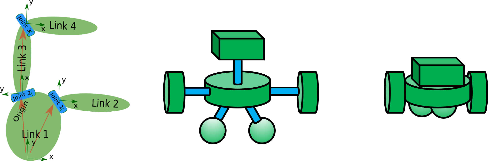
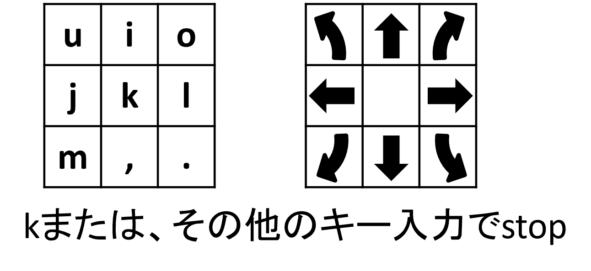
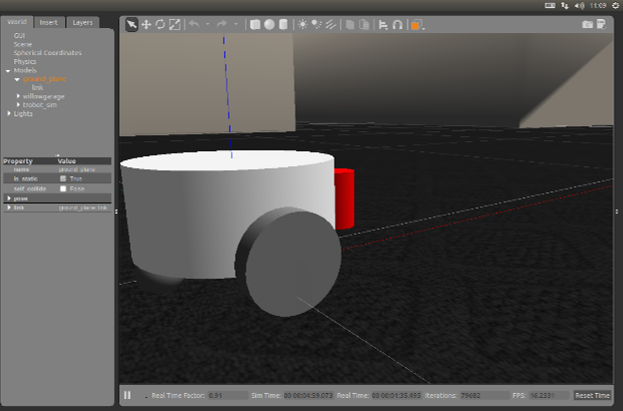
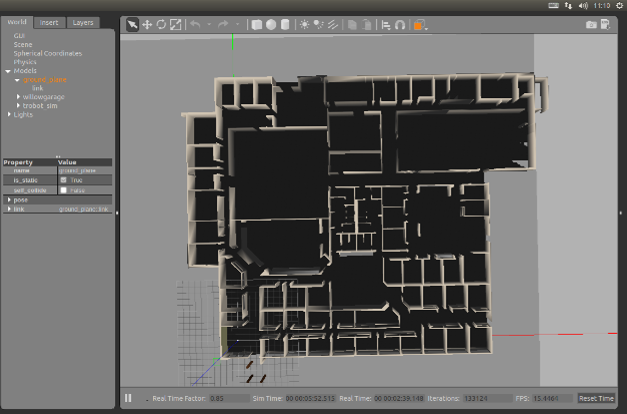
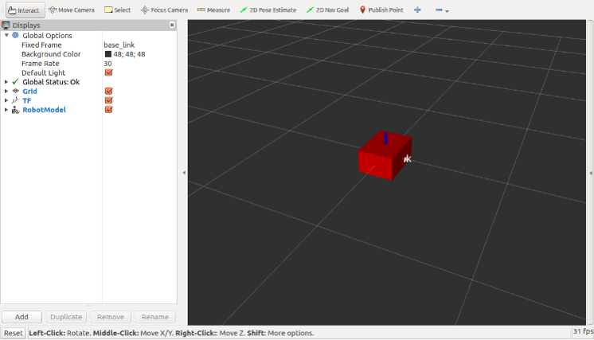
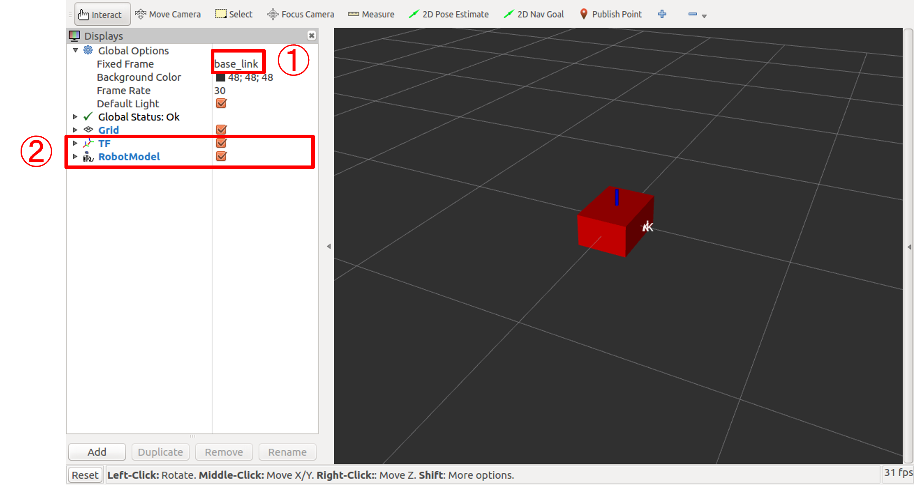
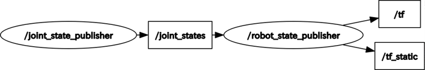
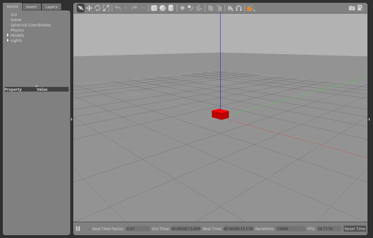

## ロボットモデルを自作するための参考サイト
- [nav2のSetting Up The URDFチュートリアル](https://navigation.ros.org/setup_guides/urdf/setup_urdf.html)
- [nav2のSimulating an Odometry System using Gazeboチュートリアル](https://navigation.ros.org/setup_guides/odom/setup_odom.html#simulating-an-odometry-system-using-gazebo)
- [nav2のSimulating Sensors using Gazeboチュートリアル](https://navigation.ros.org/setup_guides/sensors/setup_sensors.html#simulating-sensors-using-gazebo)

差動2輪のロボットモデルであれば、下記のような円柱と球だけで作成することができるため、URDFの記述量も多くはなりません。  
自作のロボットモデルであればセンサ構成等も自由に配置できるため、一度作成してみることをオススメします。














## Gazeboをroslaunchで起動する
ros
```
<?xml version="1.0"?>
<launch>
    <include file="$(find gazebo_ros)/launch/empty_world.launch">
        <arg name="world_name" value="任意ファイル名.worldのパス"/>
        <arg name="debug" value="false"/>
        <arg name="gui" value="true"/>
        <arg name="paused" value="false"/>
        <arg name="use_sim_time" value="true"/>
        <arg name="headless" value="false"/>
    </include>
</launch>

```
## シミュレータ上でロボットを動かす

## URDFを用いてシンプルなモデルを出現させる

URDF(Unified Robot Description Format)とは
LinkとJointで構成されたロボットの構造を記述するためのXMLのフォーマット。
Linkは、「見た目の形」「衝突判定の形」「重さとイナーシャ(慣性モーメント)」等を持ち、ロボットの1部品(タイヤ等)を表す。
Jointは、木構造(親と子)で管理され、Link間の接続点を表す。

独自モデルを作成する際にURDF(xacro)を用いて記述する


- Linkの必須要素
    - name：リンクの名前
- Jointの必須要素
    - name：ジョイントの名前
    - type：ジョイントの種類
- Linkのオプション要素
    - visual：見た目の要素
    - collision：衝突判定要素
    - inertia：重さやイナーシャ(慣性モーメント)等の質量特性要素
- Jointのオプション要素
    - parent：親リンクの名前要素
    - child：子リンクの名前要素
    - origin：親リンクと子リンクの位置姿勢関係要素
    - axis：jointの回転やスライドをどの軸基準で行うかの指定
    - limit：jointの回転やスライドに制限がある場合の上限・下限等の指定

Gazeboでシミュレーションを行う場合は上記の要素を用いる


URDFを記述し、立方体・球体・円柱をRvizで表示する
以下の3個ファイルを用いる
ファイルの場所：~/catkin_ws/src/simple_model_rviz/
simple_model.urdf
simple_model.rviz
simple_model.launch
【起動方法】
simple_model_rvizフォルダを~/catkin_ws/src/に配置する
端末を開き(Ctrl + Alt + t)、以下のコマンドを実行する
         $ roslaunch simple_model_rviz simple_model.launch


## simple_model.urdf
```xml
<?xml version="1.0"?>	
<robot name="simple_model"> <!--・・・<robot>要素でモデルの名前を定義する-->
 <link name="base_link"/> <!--・・・実体のない<link>要素"base_link"を定義する-->

 <joint name="box_joint" type="continuous"> <!--・・・<joint>要素の名前と接続方式を定義する-->
  <parent link="base_link"/> <!--・・・親の<link>要素を指定する-->
  <child link="model_link"/> <!--・・・子の<link>要素を指定する-->
  <origin xyz="0 0 0" rpy="0 0 0"/> <!--・・・<link>間の位置関係を定義する-->
  <axis xyz="1 0 0"/> <!--・・・軸方向の基準定義する-->
  <limit lower="-1.57" upper="1.57" effort="0.5" velocity="6.0"/> <!--・・・制限を定義する-->
 </joint>

 <link name="model_link"> <!--・・・<link>要素"model_link"を定義する-->
  <visual> <!--・・・<link>要素の見た目の形を定義する-->
   <geometry> <!--・・・形状を記述する-->
    <box size="0.4 0.3 0.2"/> <!--・・・立方体（x,y,z）を定義する-->
    <!-- <cylinder length="0.3" radius="0.3"/> --> <!--・・・円柱を定義する(半径と高さを指定)-->
    <!-- <sphere radius="0.3" /> --> <!--・・・球体を定義する(半径を指定)-->
    <!-- <mesh filename="package://(パッケージ名)/(ファイルパス)/(ファイル名)" /> -->
   </geometry>
   <origin xyz="0 0 0" rpy="0 0 0"/> <!--・・・<link>原点との位置関係を定義する-->
   <material name="red"> <!--・・・色の名前定義-->
    <color rgba="1.0   0.0   0.0   2.0"/> <!--・・・色の数値定義-->
   </material>
  </visual>
 </link>
 </robot>
```

Rvizに表示するまでならば<visual>要素があれば良い

## simple_model.rviz

Global OptionsのFixed Frameをbase_linkに変更する
AddでDisplaysにTFとRobotModelを追加する
Save Config Asでrvizの設定をsimple_model.rvizに保存する

## simple_model.launch
```xml
<?xml version="1.0"?>
<launch>  
  <arg   name="rvizconfig"   default="$(find simple_model_rviz)/simple_model.rviz"/>  <!--・・・Rvizの設定ファイル-->
  <param   name="robot_description"   textfile="$(find simple_model_rviz)/simple_model.urdf"/>   <!--・・・urdfファイルを読み込む-->
  <param   name="use_gui" value="true"/>  <!--・・・joint_state_publisherのGUIを表示するか-->
  <node   pkg="joint_state_publisher"   type="joint_state_publisher"   name="joint_state_publisher"/>  
  <node   pkg="robot_state_publisher"   type="state_publisher"   name="robot_state_publisher"/>  
  <node   pkg="rviz"   type="rviz"   name="rviz"   args="-d $(arg rvizconfig)" required="true"/> <!--・・・Rvizの設定を読み込んで起動-->
</launch>
```

robot_descriptionがjoint_state_publisherとrobot_state_publisherにおいてURDFデータを格納しておくパラメータとして動作する。
動作原理としては、joint_state_publisherがjoint_stateを発行し、robot_state_publisherが受信し、tfに変換する。それをRvizが表示している。
動作中にrqt_graphコマンドで以下の図が表示される。

Rviz中でモデルを表示するためにはjoint_state_publisherとrobot_state_publisherが必要

## Xacroについて
URDFの書き方を紹介したが、繰り返しパターンや数式を扱うことができず、ロボットを記述する場合、長文になり不便である。
そこでURDFのマクロ記述記法のXacroを紹介する。

Xacroの機能
Property Block：定数の定義
Math expressions：算術記号などの数式が記述可能
Conditional Blocks：if/else文が利用可能
Rospack commands：roslaunchと同じfindやargが利用可能
Macros：引数をとれるマクロが記述可能
Including other xacro files：他のXacroファイルをInclude可能

## Xacroを用いてシンプルなモデルを出現させる

【実習2】
Xacroを記述し、立方体・球体・円柱をgazeboで表示する
実行方法：
```
$ roslaunch simple_model_gazebo    simple_model_gazebo.launch
```
ファイルの場所：~/catkin_ws/src/simple_model_gazebo/
inertia.xacro
simple_model.gazebo.xacro
simple_model.urdf.xacro
simple_model_gazebo.launch

## イナーシャ(慣性モーメント)について

イナーシャは慣性モーメントとも呼ばれ、回転の運動において「重さ」に相当するもの。重さ（mass）は1次元だが、イナーシャは回転方向も考慮した値で6次元の値になる。

正確な値はCADなどを用いる必要があるが、大体の近似値になる値の出し方があります。

(D:長さ[m]、M:重さ[kg])

この値からかけ離れた値がイナーシャに入っていると期待した動作をしないことがある

## ①inertia.xacro

```xml
<?xml version="1.0"?>
<robot xmlns:xacro="http://www.ros.org/wiki/xacro">
  <!-- PROPERTY LIST -->
  <!--All units in m-kg-s-radians unit system -->
  <property name="M_PI" value="3.1415926535897931" />
  <property name="M_PI_2" value="1.570796327" />
  <property name="DEG_TO_RAD" value="0.017453293" />
  <!-- Macro for calculating inertia of cylinder -->
  <xacro:macro name="cylinder_inertia" params="mass radius height">
    <mass value="${mass}"/>
    <inertia ixx="${mass*(3*radius*radius+height*height)/12}" ixy = "0" ixz = "0"
         Iyy="${mass*(3*radius*radius+height*height)/12}" iyz = "0"
         izz="${mass*radius*radius/2}" />
  </xacro:macro>
  <!-- Macro for calculating inertia of box -->
  <xacro:macro name="box_inertia" params="mass height width depth">
    <mass value="${mass}"/>
    <inertia ixx="${(mass*(width*width+depth*depth))/12}" ixy = "0" ixz = "0"
         iyy="${(mass*(height*height+depth*depth))/12}" iyz = "0"
         izz="${(mass*(height*height+width*width))/12}" />
  </xacro:macro>
  <!-- Macro for calculating inertia of sphere-->
  <xacro:macro name="sphere_inertia" params="mass radius">
    <mass value="${mass}"/>
    <inertia ixx="${mass/5*radius*radius}" ixy = "0" ixz = "0"
         iyy="${mass/5*radius*radius}" iyz = "0"
         izz="${mass/5*radius*radius}" />
  </xacro:macro> 
</robot>
```

## ②simple_model.gazebo.xacro
gazebo関連の内容を記述

```xml
<?xml version="1.0"?>
<robot xmlns:xacro="http://www.ros.org/wiki/xacro"><!--xacroの宣言-->

  
  <gazebo reference="model_link"><!--gazeboに表示するlink名-->

    <!-- <material>Gazebo/White</material> -->
    <material>Gazebo/Red</material><!--Gazeboでの色の指定-->

    
    <turnGravityOff>false</turnGravityOff><!--モデル自身にかかる重力をOFFにするか-->

    
    <selfCollide>false</selfCollide><!--モデル同士の衝突をありにするか-->

    <!--muはGazeboでの摩擦係数、0.1（よく滑る）~1.0以下（普通の物）-->
    <mu1 value="1.0"/>
    <mu2 value="1.0"/>
  </gazebo>
</robot>
```


## ③simple_model.urdf.xacro
```xml
<?xml version="1.0"?>
<robot name="simple_model" xmlns:xacro="http://www.ros.org/wiki/xacro">
 <xacro:include filename="$(find simple_model_gazebo)/inertia.xacro" />
 <xacro:include filename="$(find simple_model_gazebo)/simple_model.gazebo.xacro" />
 <!-- <link name="base_link"/> -->
 <link name="base_link">
  <inertial>
   <mass value="0.0001" />
   <origin xyz="0 0 0" />
   <inertia ixx="0.0001" ixy="0.0" ixz="0.0"
        iyy="0.0001" iyz="0.0"
        izz="0.0001" />
  </inertial>
 </link>
 <joint name="box_joint" type="continuous">
 <!-- <joint name="box_joint" type="fixed"> -->
  <parent link="base_link"/>
  <child link="model_link"/>
  <origin xyz="0 0 0.1" rpy="0 0 0"/>
  <axis xyz="1 0 0"/>
  <limit lower="-1.57" upper="1.57" effort="0.5" velocity="6.0"/>
 </joint>
<link name="model_link">
  <visual>
   <geometry>
    <box size="0.4 0.3 0.2"/>
    <!-- <cylinder length="0.3" radius="0.3" /> -->
    <!-- <sphere radius="0.3" /> -->
   </geometry>
   <origin xyz="0 0 0" rpy="0 0 0"/>
   <material name="red">
    <color rgba="1.0 0.0 0.0 2.0"/>
   </material>
  </visual>
  <!-- add -->
  <collision>
   <geometry>
    <box size="0.4 0.3 0.2"/>
    <!-- <cylinder length="0.3" radius="0.3" /> -->
    <!-- <sphere radius="0.3" /> -->
   </geometry>
   <origin xyz="0 0 0" rpy="0 0 0"/>
  </collision>
  <inertial>
   <origin xyz="0 0 0.0" rpy="0 0 0" />
   <box_inertia mass="5" height="0.4" width="0.3" depth="0.2"/>
   <!-- <cylinder_inertia mass="5" radius="0.3" height="0.3"/> -->
   <!-- <sphere_inertia mass="5" radius="0.3"/> -->
  </inertial>
  <!-- add -->
 </link>
 </robot>

```

## <Inertial>と<collision>について

<inertial>タグ
<inertial>タグは重さに関するパラメーターを設定する。
<math>は重さでkg単位
<inertia>は慣性モーメント
<inertia>は本来はきちんと計算をして入れる必要がある	が、大体の値に設定する
fixed以外（continuousやrevoluteやprismatic）でのみ他のlinkと接続されていない<link>は必ず<inertial>を設定する必要がある
<collision>タグ
<collision>は衝突判定に使う形状を表す
要素は<visual>と同様に<geometry>を持つ
必ず1つ以上は設定していないとgazebo上で床を抜けてはるか下まで落ちてしまう。

## ④simple_model_gazebo.launch
```xml
<?xml version="1.0"?>
<launch>
  <arg name="rvizconfig" default="$(find simple_model_gazebo)/simple_model.rviz"/>
  <param name="robot_description" command="$(find xacro)/xacro.py $(find simple_model_gazebo)/simple_model.urdf.xacro"/> 
  <param name="use_gui" value="true"/>
  <node pkg="joint_state_publisher" type="joint_state_publisher" name="joint_state_publisher"/>
  <node pkg="robot_state_publisher" type="state_publisher" name="robot_state_publisher"/>
  <node pkg="rviz" type="rviz" name="rviz" args="-d $(arg rvizconfig)" />
  
  <!-- We resume the logic in empty_world.launch -->
  <include file="$(find gazebo_ros)/launch/empty_world.launch">
    <arg name="debug" value="false" />
    <arg name="gui" value="true" />
    <arg name="paused" value="false"/>
    <arg name="use_sim_time" value="true"/>
    <arg name="headless" value="false"/>
  </include>
  <!-- Run a python script to the send a service call to gazebo_ros to spawn a URDF robot -->
  <node pkg="gazebo_ros" type="spawn_model" name="urdf_spawner" respawn="false" output="screen" args="-urdf -model simple_model -param robot_description"/>
</launch>

```
## Xacroを用いて動くロボットを出現させる
【場所】
~/catkin_ws/src/trobot_sim/urdf/
body/body.urdf.xacro	body_linkのマクロ定義
body/body.gazebo.xacro	bodyのgazebo部分
caster/caster.urdf.xacro	casterのマクロ定義
caster/caster.gazebo.xacro	casterのgazebo部分
wheel/wheel.urdf.xacro	wheelのマクロ定義
wheel/wheel.gazebo.xacro wheelのgazebo部分
wheel/wheel.trans.xacro	wheelのトランスミッション
camera.macro.xacro	カメラセンサのマクロ定義
laser.macro.xacro		LRFセンサのマクロ定義
trobot_sim.xacro		trobotモデルの統括ファイル

## ⑦wheel.trans.xacro

```xml
<?xml version="1.0"?>
<robot name="simple_model" xmlns:xacro="http://www.ros.org/wiki/xacro">
  <!-- include file -->

  <xacro:macro name="wheel_trans" params="prefix">
    <transmission name="${prefix}_trans">
      <type>transmission_interface/SimpleTransmission</type>
      <joint name="${prefix}_joint">
        <hardwareInterface>hardware_interface/VelocityJointInterface</hardwareInterface>
      </joint>
      
      <actuator name="${prefix}_motor">
        <hardwareInterface>hardware_interface/VelocityJointInterface</hardwareInterface>
        <mechanismReduction>1</mechanismReduction>
      </actuator>
    </transmission>
  </xacro:macro> 
</robot>
```

hardware_interfaceの種類
hardware_interface::EffortJointInterface      :力制御
hardware_interface:: JointStateInterface       :位置制御
hardware_interface:: VelocityJointInterface  :速度制御

## ⑨laser.macro.xacro(LRFシミュレーション)

```xml
 <gazebo reference="${prefix}_link">
      <material>Gazebo/Red</material>
      <sensor type="ray" name="${prefix}">
        <pose>0 0 0 0 0 0</pose>
        <visualize>false</visualize>
        <update_rate>10</update_rate>
        <ray>
          <scan>
            <horizontal>
              <samples>400</samples>
              <resolution>1</resolution>
              <min_angle>${radians(-90)}</min_angle>
              <max_angle>${radians( 90)}</max_angle>
            </horizontal>
          </scan>
          <range>
            <min>0.10</min>
            <max>10.0</max>
            <resolution>0.01</resolution>
          </range>
         <noise>
            <type>gaussian</type>
            <mean>0.0</mean>
            <stddev>0.01</stddev>
          </noise>
        </ray>
        <plugin name="gazebo_ros_lidar_controller" filename="libgazebo_ros_laser.so">
          <topicName>/scan</topicName>
          <frameName>${prefix}_link</frameName>
        </plugin>
      </sensor>
    </gazebo>

```
LRFのGazeboプラグインを用いる
その他にもカメラ、深度カメラ、IMU、
バンパ等のプラグインが選択可能

## ⑩trobot_sim.xacro(差動二輪制御の設定)

```xml
<!-- Differential drive controller  -->
  <gazebo>
    <plugin name="differential_drive_controller" filename="libgazebo_ros_diff_drive.so">
      <rosDebugLevel>Debug</rosDebugLevel>
      <publishWheelTF>false</publishWheelTF>
      <robotNamespace>/</robotNamespace>
      <publishTf>1</publishTf>
      <publishWheelJointState>false</publishWheelJointState>
      <alwaysOn>true</alwaysOn>
      <updateRate>100.0</updateRate>
      <leftJoint>left_wheel_joint</leftJoint>
      <rightJoint>right_wheel_joint</rightJoint>
      <wheelSeparation>0.2</wheelSeparation>
      <wheelDiameter>0.08</wheelDiameter>
      <broadcastTF>1</broadcastTF>
      <wheelTorque>30</wheelTorque>
      <wheelAcceleration>1.8</wheelAcceleration>
      <commandTopic>cmd_vel</commandTopic>
      <odometryFrame>odom</odometryFrame>
      <odometryTopic>odom</odometryTopic>
      <!--<robotBaseFrame>base_footprint</robotBaseFrame>-->
      <robotBaseFrame>base_link</robotBaseFrame>
    </plugin>
  </gazebo>

```

差動二輪制御のプラグインを使用
その他にもスキッドステア駆動、
全方向移動、マニピュレータが選択可能


