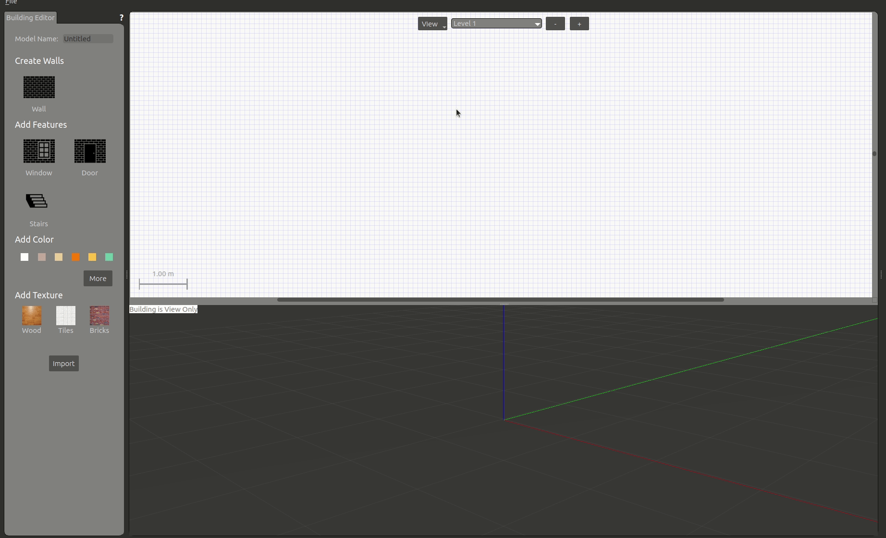

## Gazeboの起動方法
Gazeboはgzserverとgzclientの2個で構成されています。

- gzserver：Gazeboワールドを立ち上げるプログラム(物理シミュレーションを行う)
- gzclient：Gazeboワールドをレンダリングして表示するプログラム

上記の通り、gzserverのみでシミュレーションは動くので、レンダリングして表示しなくてもよいなら、gzclientは立ち上げなくてもよいです。計算リソースが厳しい場合は実行しない選択肢もあります。
```sh
# まとめて起動(gzserver+gzclient)
gazebo
# サーバーシミュレーションのみ起動
gzserver
# レンダリングを起動(gzserverがない場合は立ち上がるまで待つ)
gzclient
```
サーバーとクライアントを分離できるため、同一のローカルネットワークに繋がっていれば、別PCでも実行可能です。その場合には、両方のPCに下記の環境設定が必要になります。下記の例では`192.168.25.115`の部分が`gzserver`を動作させるPCのIPアドレスになります。
```sh
export GAZEBO_MASTER_URI=http://192.168.25.115:11345
```

---

## GazeboのGUIツールの使い方
端末を開き(Ctrl+Alt+T)、下記コマンドを入力
```sh
gazebo
```
Gazeboには多くのGUIツールが用意されている。


---

### サンプルオブジェクト(立方体/球/円柱)の配置
サンプルオブジェクトのGUIを選択し、ワールド上の任意の位置でクリックすることでサンプルオブジェクトを配置できます。


---

### 物体の選択
物体の選択(矢印アイコン)が選択されている状態で、ワールド上の物体をクリックすることで、プロパティなどをの値を確認することができます。

---

### 物体の移動
物体の移動(十字矢印アイコン)が選択された状態で、物体を選択するとx/y/z方向の矢印が出現し、各軸を選択しドラッグすることで特定の軸方向に移動させることができます。上方向に移動させ離すと、物理シミュレータの重力の影響で自由落下をします。
また、地面や他の物体と干渉した場合は反発します。


---

### 物体の回転
物体の回転が選択された状態で、物体を選択するとroll/pitch/yaw方向の回転軸が出現し、各軸を選択しドラッグすることで回転できます。


---

### 物体の伸縮
物体の伸縮が選択された状態で、物体を選択するとx/y/z方向の矢印が出現し、各軸を選択しドラッグすることで大きさを変更することができます。


---

### 選択の解除
物体の選択(矢印アイコン)が選択することで、各操作を解除できます。(Escキーでも可能)

---

### 光のライティング

光のライティングは3種類あります。

- 少し広い範囲を照らす弱い光
- 狭い範囲を照らす強い光
- 全体を照らす強い光


---

### 時刻の再生/停止
下部にある再生/停止アイコンでgazeboの時間を再開・停止することができます。シミュレーション中に複数の障害物を配置したい場合や微調整したい場合などに便利です。


---

### Building Editor
上タブの`Edit`⇒`Building Editor`を選択することで起動できる。オブジェクト作成用のエディタです。部屋の間取りなどを作成する際に簡易に作成が可能です。

基本操作は、`Wall`を選択し、壁の角をクリックすることで作成できます。壁作成を中断する場合はEscキーで中断できます。作成したモデルは`File`⇒`Save`(Ctrl+s)でモデル名を付けて保存ができます。保存場所は~/building_editor_models/以下に保存され、次回起動以降も`Insertタブ`から呼び出し複製することができます。`Building Editor`を終了する場合は`File`⇒`Exit Building Editor`(Ctrl+x)で終了できます。



---

### Model Editor
上タブの`Edit`⇒`Model Editor`を選択することで起動できる。オブジェクト作成用のエディタです。数値を入力して細かい調整が可能です。

基本操作は、サンプルオブジェクトを選択し、右クリックすることで`Inspectorウインドウ`を開き、値を調整できます。`Inspectorウインドウ`には`Link/Visual/Collisionタブ`があります。  
`Linkタブ`では位置などを調整できます。  
`Visualタブ`では見かけ上の大きさや色などを調整できます。  
`Collisionタブ`では当たり判定の大きさなどが調整できます。  
作成したモデルは`File`⇒`Save`(Ctrl+s)でモデル名を付けて保存ができます。
保存場所は`~/model_editor_models/以下`に保存され、次回起動以降も`Insertタブ`から呼び出し複製することができます。`Model Editor`を終了する場合は`File`⇒`Model Editor`(Ctrl+x)で終了できます。


---

### Insertタブ
`Insertタブ`では既存モデルを選択し、ワールド上に配置することができます。インターネット接続があれば、多くのgazeboモデルが用意されているサーバーに接続し、選択できるようになります。(接続には起動後3～5分程度かかります)  
Gazeboモデルを選択するとダウンロードが開始され、少し待つと配置できるようになります。ダウンロードしたモデルは`~/.gazebo/models/以下`に保存され、次回以降はダウンロード待ち時間なしで配置できます(オフラインでも可能)。

- gazeboモデルの事前ダウロード方法
  - Insertタブでダウンロードできるモデルは[osrfのgazebogithub]上にあります。


---

### ワールドを保存する
`File`⇒`Save World`(Ctrl+s)で現在のワールドの状態をファイルに保存できます。ファイルはSDFフォーマットで記述されます。保存時の注意点として、拡張子を入力しないと拡張子なしで保存されるため、拡張子を.worldで保存するのが一般的になっています。

---

### 保存したワールドを呼び出す
起動時のオプションで-O(大文字)を付けることで既存のワールドを呼び出せます。
```sh
gazebo -O worldファイル名
```

---


