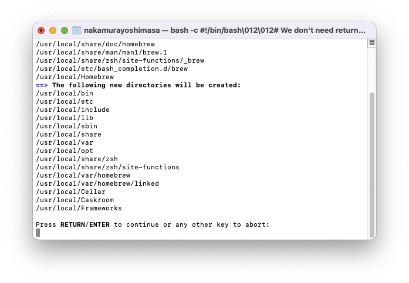

# Homebrewを用いたインストール
Homebrewを用いてmacOS上に直接Gazeboをインストールします。
## Homebrewとは
HomebrewはmacOSやLinux用のパッケージマネージャーです。  
Appleが提供していないライブラリや開発ツールなどを簡単にインストールすることができます。

## Homebrewのインストール
ターミナルを開き下記コマンドを入力します。
```sh
/bin/bash -c "$(curl -fsSL https://raw.githubusercontent.com/Homebrew/install/HEAD/install.sh)"
```


パスワードを入力します。


下記が出たら`Enterキー`を押します。


下記のように`Installation successful`と表示されていればインストール完了です。  


## Gazeboのインストール
Gazeboをインストールします。
```sh
curl -ssL http://get.gazebosim.org | sh
```
上記はGazeboのone-linerインストール方法で、他の環境でも同様にインストールできます。  PC環境を自動認識して、適切なインストール方法を選択してくれます。  
実態としては下記を行っています。  
```sh
# Homebrewのインストール
ruby -e "$(curl -fsSL https://raw.githubusercontent.com/Homebrew/install/master/install)"
# XQuartzのインストール
brew install homebrew/cask/xquartz
# osrf/simulationリポジトリをタップする(リポジトリ内にアクセス可能にする)
brew tap osrf/simulation
# gazebo11のインストール
brew install gazebo11
```

## Gazeboの動作確認
新しくターミナルを開き、下記を入力して実行します。
```sh
gazebo 
```
下記のような画面が出ればインストール成功です。


## Gazeboのアンインストール
アンインストールする方法も記載しておきます。(講習会終了後削除していただて構いません)
```sh
brew uninstall gazebo11
brew untap osrf/simulation
brew uninstall --cask xquartz
brew cleanup
```


## 参考サイト
- [Homebrew本家ページ](https://brew.sh/ja/)
- [Install Gazebo on Mac (using homebrew)](https://classic.gazebosim.org/tutorials?tut=install_on_mac&cat=install)