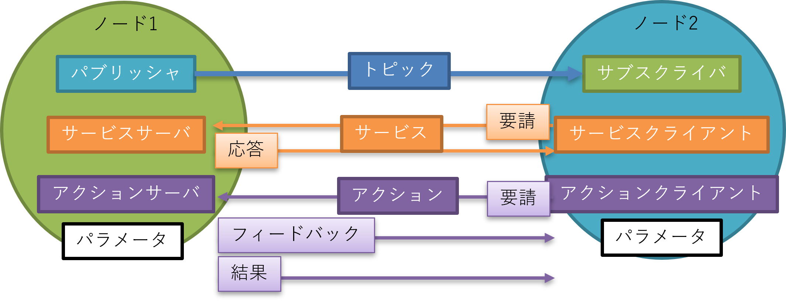
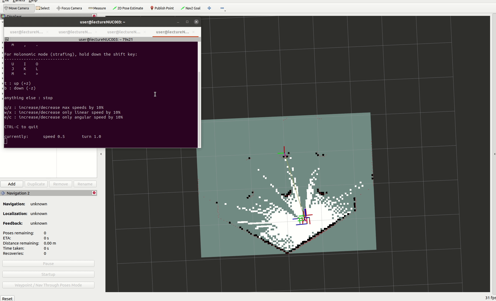
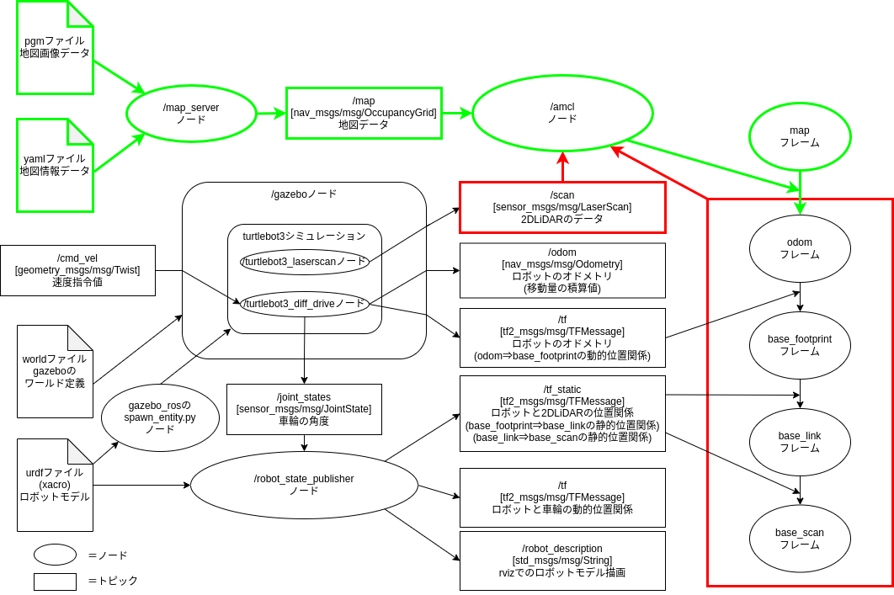

# Gazeboを用いたロボットシステム開発

## 自律走行ロボットの用途

まず自律走行ロボットは何ができて、何に使えるのかを考えます。

- 何ができる？
    - 目的地まで自律的に走行してくれる
- 何に使える？

<mark>__自律走行ロボットは様々な用途で使うことができます。__</mark>

---

## 自律走行に必要なソフトウェア

自律走行を実現するために必要な機能は以下のようになります。

- 地図(地図作成)  
    自律走行を行う環境の地図を作成する  
    1. ロボットを走行させて地図を作成する(SLAM(Simultaneous Localization and Mapping))  
    2. 図面からの手書きで地図を作成する  
- 自己位置推定  
    現在ロボットが地図内のどこにいるか推定する  
- 経路計画  
    現在地から目的地までの経路を計画する  
- 経路追従  
    計画した経路に沿うようにロボットを制御する  
- 障害物停止・回避  
    走行中に現れる障害物を検知し、停止・回避動作を行う  

これらの機能は1つずつでも研究分野になっているほど高度な内容になります。

<mark>__自律走行を実現するためには多数の高度なソフトウェアが必要__</mark>

これに加えて、自律走行ロボットの実現には、

- センサのI/O
- ロボット本体のモーター制御
- ユーザーインターフェース(UI)
- コンテンツ(エンターテイメント関連の場合)
- 複数台ロボットを統合管理・制御する上位システム  
etc...

などのソフトウェアが必要になります。

---

## ROS/ROS2とは

- ROS2とは、Robot Operating System2の略で、ロボットソフトウェアプラットフォーム(ミドルウェア)の1つ。

- ROS2の概要
    - 世界で最も使われているロボット用ミドルウェアROSの次世代版
    - 便利な開発ツール・ライブラリが豊富(Rviz、rqt、Gazebo、Navigation2、MoveIt2 etc.)
    - サポート言語：(公式)C++,Python3、(非公式)Java,C#,Node.js,Rust,Go,Julia,Objective-C,Swift
    - 開発管理団体：Open Robotics、ROS2 Technical Steering Committee
    - 国内コミュニティ：ROS Japan User Group
    - ライセンス：BSD(商用利用可能)
    - 対応OS：Linux、MacOS、Windows10

クラウド連携やMatlab連携、ゲームエンジン連携(Unity,UE4/5)も進んでいる  

<mark>__ユーザ数が多く、関連ツール・ライブラリが豊富なため最も利用されている__</mark>

---

## シミュレータGazeboについて

---

## Gazeboとは
オープンソースの3Dロボットシミュレータの一つ

特徴   

- ROS/ROS2との連携が充実(Open Roboticsが開発)
- ROS2を用いずに単独でも使用可能
- カメラやLiDARなどのセンサシミュレーションが豊富
- 公開されているロボットモデルが豊富
- リアルタイム性を重視
- 物理エンジンの切り替えが可能(ODE(デフォルト),Bullet,Simbody,DART)
- Apacheライセンス

<mark>Gazeboを用いることで実機が無くてもロボットのソフトウェアを開発・検証できます</mark>

今回使用しているGazeboのバージョンは[Gazebo11](https://classic.gazebosim.org/tutorials)でほぼ開発が終了しています。  
現在次期バージョンの[Ignition Gazebo](https://gazebosim.org/docs/garden/releases)が開発されています。
まだIgnition Gazeboは情報が少ないですが、今後置き換わって行きます。

---

## macOSでGazeboを動かす方法
macOSでGazeboを動かす方法は下記の4通りがあります。

1. macOSに直接インストールして動かす(homebrew)
2. 仮想マシン(UTM)上のUbuntuで動かす
3. macOSのDocker上のUbuntuで動かす
4. 仮想マシン(UTM)のDocker上のUbuntuで動かす

それぞれメリットとデメリットがあります。

||メリット|デメリット|
|---|---|---|
|①直接インストール|環境構築が簡単 パフォーマンスが良い|環境が汚れる ROS/ROS2連携に接続手順が必要|
|②仮想マシン|参考情報が多い USBデバイスが使える|Ubuntuの知識が必要 非力なPCだと動作が重い|
|③macOS上のDocker|移植性が高い パフォーマンスが良い|Dockerの知識が必要 Ubuntuの知識が必要 USBデバイスが使えない|
|④仮想マシン上のdocker|移植性が高い USBデバイスが使える|Dockerの知識が必要 Ubuntuの知識が必要 非力なPCだと動作が重い|

導入ハードルの高さは、①<②<③<④順で、特にDockerのGUIやGPU周りの設定が使用しているPCによって異なるため難易度が高いです。

③に関しては[こちら](https://github.com/Tiryoh/docker-ros-desktop-vnc)を使用することで環境依存を気にせずに実行できます。

## GazeboとROSを連携するメリット

GazeboとROSを連携することで、実機とシミュレーションの入出力のインターフェイスを同一にすることができるため、その上位に当たるプログラムを同じものが使用可能になります。

## ROS1/ROS2の動作原理

ROS1/ROS2は、<mark>ノードと呼ばれる1つの機能を持つ実行可能な1個のプログラム</mark>を複数つなげていくことで動作します。  
ノードはROS1/ROS2における最小プロセスで、<mark>パッケージと呼ばれるROS1/ROS2ソフトウェアの基本単位</mark>で管理されます。  
各ノードは起動後、接続条件に合うノードを探索し、接続します。  
接続したノード間ではメッセージ通信と呼ばれるデータの送受信が開始されます。(メッセージ通信の説明は後述します。)  

|ROS2用語名称|説明|
|---|---|
|マスタ|(<mark>ROS2で廃止</mark>)ノードを接続するネームサーバーの役割(<mark>必須、ただし複数PC内で1個</mark>)|
|デーモン|(<mark>ROS2で新規</mark>)ノードを高速に発見するためのネームサーバーの役割(<mark>無しでも動作</mark>)|
|ノード|機能や目的で細分化したROS2の最小プロセス(<mark>実行可能な1個のプログラム</mark>)|
|パッケージ|<mark>ROS1/ROS2ソフトウェアの基本単位</mark>(パッケージ内にノードを配置する)|
|メタパッケージ|共通の目的を持つ<mark>パッケージの集合体</mark>(例:navigation2など)|
|メッセージ通信|ノード間でデータの送受信を行う仕組み|

## メッセージ通信の種類

|ROS2用語名称|説明|
| --- | --- |
|トピック|センサ等の連続的なデータ通信が必要な時に使用する通信(単方向非同期通信)|
|サービス|状態確認等の要請後に即時応答が必要な時に使用する通信(双方向同期通信)|
|アクション|目標地点への移動指令など、要請後の応答に時間がかかる処理を呼び出す場合や処理中の中間結果が必要な時に使用する通信(双方向非同期通信)|
|パラメータ|移動速度の最大値など、ノードのパラメータ変更時に使用される通信|

## トピック通信

トピック通信は、送受信するデータの経路を<mark>トピック</mark>、データを<mark>メッセージ</mark>と呼び、

- データ(メッセージ)を送信する<mark>パブリッシャ(Publisher)(配信者)</mark>
- データ(メッセージ)を受信する<mark>サブスクライバ(Subscriber)(購読者)</mark>

の2つから構成されます。

- トピックは名前で管理され、任意の名前をつけることができます。またメッセージはデータ型を持ち、整数・小数・文字列・Bool等の基本的な型や、よく使う組み合わせ型(構造体)があらかじめ用意されています。使いたいデータ型がない場合は独自でデータ型を定義することも可能です。

- トピック通信を行うには、<mark>同じトピック名・メッセージ型であれば自動的に接続</mark>され、データ通信が行われます。
- 処理の流れとしては、パブリッシャがトピックをパブリッシュすると、サブスクライバ側でコールバック関数が呼び出され、トピックが取得できます。
- 一度接続されると、それ以降は連続してデータ通信が行われるため、センサデータの取得などに利用されます。

- 1:1の通信以外にも、1:多、多:1、多:多の通信が可能です。

- トピック名とメッセージ型が同じであれば、実装言語やOSが異なっていても通信が可能です。  
- また、1つのノードに複数のパブリッシャとサブスクライバを用いることができます。

## 実機とシミュレーションの比較
自律走行ロボットの実例をもとに説明します。

ROSにはGazeboとの橋渡し役になるライブラリとして[gazebo_ros_pkgs](https://github.com/ros-simulation/gazebo_ros_pkgs)があります。これを使用することで、Gazeboへの操作指令を抽象化し、実機と同じデータ型を実現しています。

上が実機、下がシミュレーションのノードとトピックの構成になります。

SLAMの時

Localizationの時

Navigationの時

## 参考サイト
- [qiita_M1 MacでもROSでgazeboとUSBデバイスを全部使いたい！](https://qiita.com/B-SKY-Lab/items/c519e5bc9a37b3805fd0#docker%E3%82%B3%E3%83%B3%E3%83%86%E3%83%8A%E5%86%85%E3%81%8B%E3%82%89%E3%81%AEopengl%E3%81%AE%E5%91%BC%E3%81%B3%E5%87%BA%E3%81%97%E7%A2%BA%E8%AA%8D)
- [Gazebo-Classic本家チュートリアル](https://classic.gazebosim.org/tutorials?cat=guided_a)
- [Homebrew](https://brew.sh/ja/)
- [ROS/ROS2のGUIをWebブラウザ経由でお手軽に試せるDockerfileを公開しました](https://memoteki.net/archives/2955)
- [IgnitionGazebo講座01 worldファイルを起動する](https://qiita.com/srs/items/49b8512e29bdef0ebcd6)