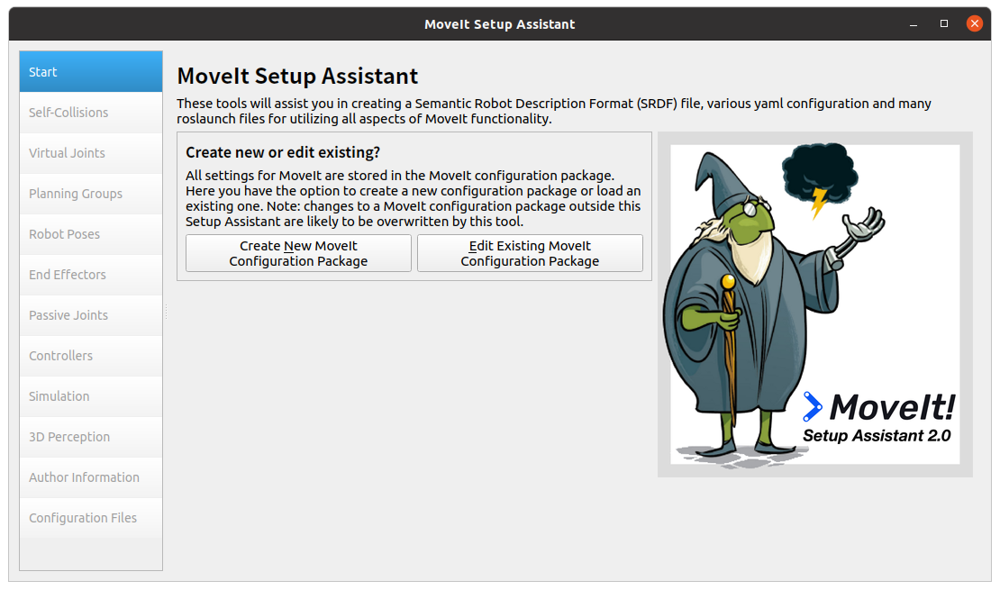
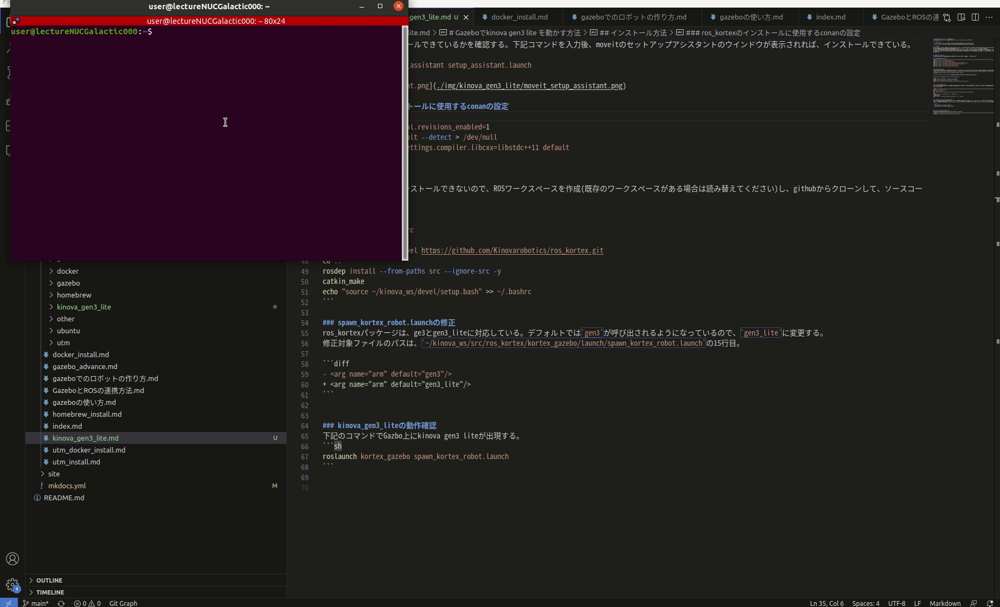

# Gazeboでkinova gen3 lite を動かす方法
Gazeboでkinova gen3 lite を動かすには`ros_kortex`と`moveit`を使用する。

## 参考ページ
- [ros_kortexパッケージ](https://github.com/Kinovarobotics/ros_kortex.git)
- [moveitのチュートリアル](https://ros-planning.github.io/moveit_tutorials/)

## 前提条件
kinova gen3 liteのドライバーは[ARM64向けには提供されていない](https://github.com/Kinovarobotics/ros_kortex/issues/227)ため、ARMベースのM1/M2チップ搭載のM1/M2_mac(新しいMac)では動作しない。ARM向けビルドは`Artik 710`,`IMX6`,`NVidia Jetson`が用意されている。  
macOSで行いたい場合は、AMDベースのIntelチップ搭載のIntel_mac(古めのMac)上にUTM上にUbuntu20.04を構築し、ROS1 Noeticをインストールして行う方法をおすすめする。  
ros_kortexパッケージはconanに依存している。conanは、ビルド時にインターネット接続が必須であるため、PCがインターネットアクセスができることを事前に確認して置く必要がある。


## インストール方法
以下には、Ubuntu20.04にROSNoeticがインストールされている前提で追加部分を記載する

### 依存関係のインストール
```sh
sudo apt install ros-noetic-moveit
sudo python3 -m pip install conan==1.59
sudo apt install ros-noetic-moveit-resources-prbt-moveit-config
sudo apt install ros-noetic-pilz-industrial-motion-planner
sudo apt install ros-noetic-rviz-visual-tools
sudo apt install ros-noetic-moveit-visual-tools
``` 

### インストール確認
moveitが正常にインストールできているかを確認する。下記コマンドを入力後、moveitのセットアップアシスタントのウインドウが表示されれば、インストールできている。
```sh
roslaunch moveit_setup_assistant setup_assistant.launch
```


### ros_kortexのインストールに使用するconanの設定
```sh
conan config set general.revisions_enabled=1
conan profile new default --detect > /dev/null
conan profile update settings.compiler.libcxx=libstdc++11 default
```

### ros_kortexのビルド
ros_kortexはaptではインストールできないので、ROSワークスペースを作成(既存のワークスペースがある場合は読み替えてください)し、githubからクローンして、ソースコードビルドを行う。

```sh
mkdir -p ~/kinova_ws/src
cd ~/kinova_ws/src
git clone -b noetic-devel https://github.com/Kinovarobotics/ros_kortex.git
cd ..
rosdep install --from-paths src --ignore-src -y
catkin_make
echo "source ~/kinova_ws/devel/setup.bash" >> ~/.bashrc
```

### spawn_kortex_robot.launchの修正
ros_kortexパッケージは、ge3とgen3_liteに対応している。デフォルトでは`gen3`が呼び出されるようになっているので、`gen3_lite`に変更する。  
修正対象ファイルのパスは、`~/kinova_ws/src/ros_kortex/kortex_gazebo/launch/spawn_kortex_robot.launch`の15行目。

```diff
- <arg name="arm" default="gen3"/>
+ <arg name="arm" default="gen3_lite"/>
```


### kinova_gen3_liteの動作確認
下記のコマンドでGazbo上にkinova gen3 liteが出現する。tab補完で入力できない場合は`rospack profile`コマンドを入力するとパスが解決する。
```sh
roslaunch kortex_gazebo spawn_kortex_robot.launch
```
