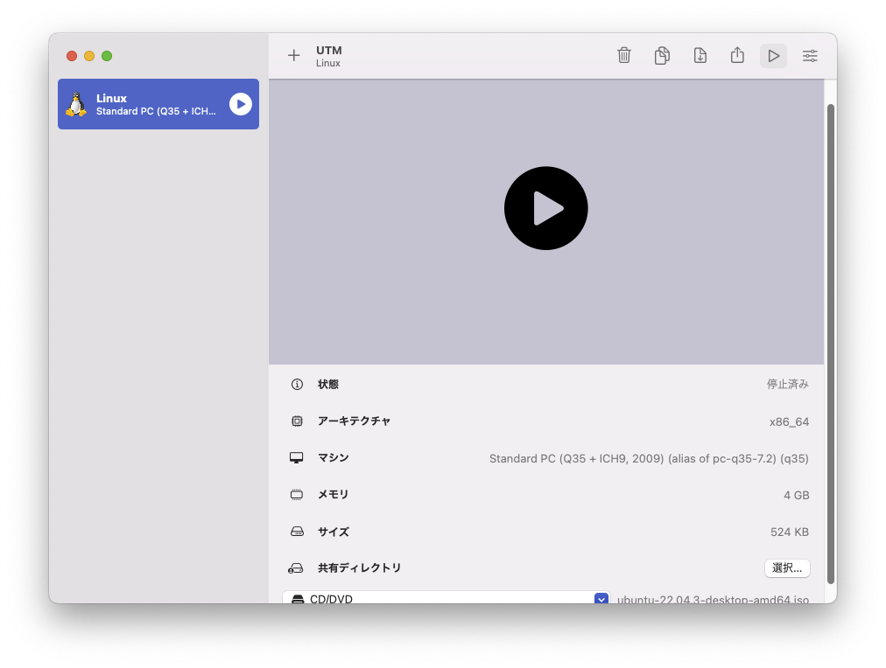
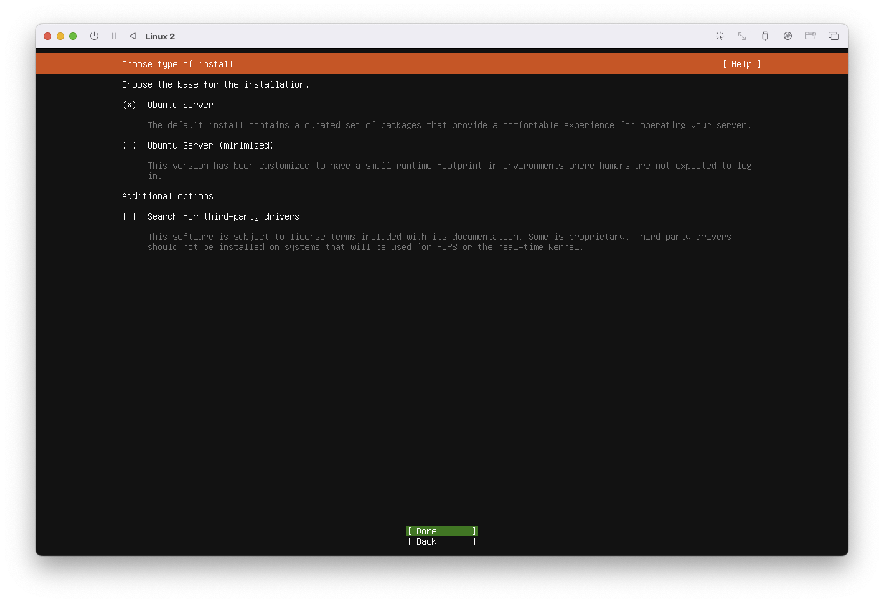
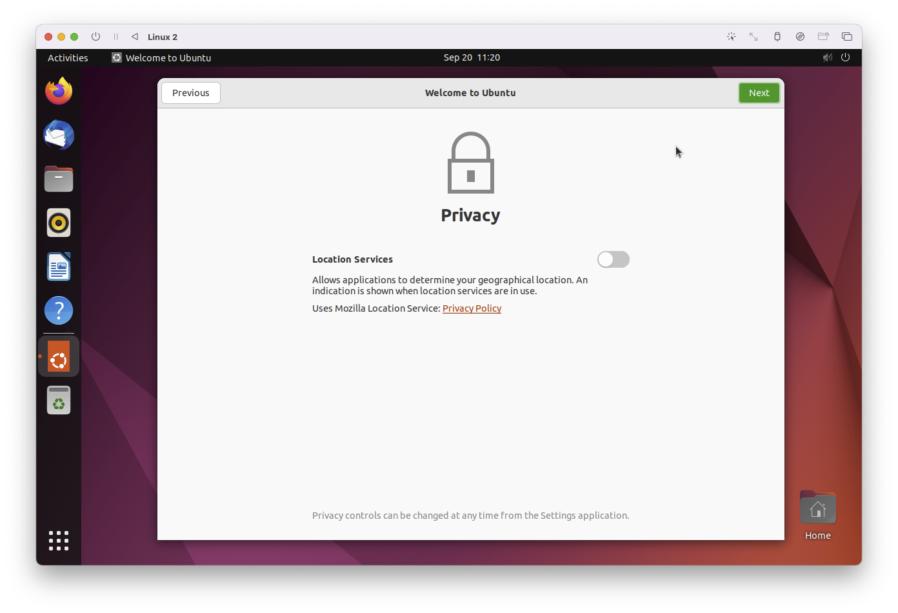

# 仮想マシン(UTM)上のUbuntuで動かす
UTM上にUbuntu20.04/22.04環境を構築し、Gazeboを動かします。


## 仮想マシンについて
仮想マシンは、OSから丸ごとシミュレーションし、別のOS環境を作ることができます。

仮想マシンのソフトウェアには有名なものとして下記があります。

- VMware
- Virtualbox
- UTM

どれを使ってもよいのですが、Mac環境においてはUTMが最も性能が出るのでお勧めです。

## UTMのダウンロード先
下記からダウンロードしましょう  
[UTMダウンロードページ](https://mac.getutm.app/)

### CPUの違いによる注意点
Macには下記の2種類があり、CPUのアーキテクチャが異なるため注意が必要です。手持ちのPCがどちらか確認してからインストールする必要があります。
大抵のアプリケーションの場合、AMD64用とARM64が用意されていますので間違えずに選びましょう。

- AMDベースのIntelチップ搭載のIntel_mac(古めのMac)
- ARMベースのM1/M2チップ搭載のM1/M2_mac(新しいMac)

## UbuntuのISOイメージのダウンロード先
仮想環境を作成するにはISOイメージが必要です。  
下記からubuntu20.04のISOイメージをダウンロードします。  

- [ubuntu20.04_AMD(Intel_mac)イメージ](https://releases.ubuntu.com/20.04.6/?_ga=2.11851060.1856522629.1695269195-1682692205.1693276115)
- [ubuntu22.04_AMD(Intel_mac)イメージ](https://ubuntu.com/download/desktop)
- [ubuntu20.04_ARM(M1/M2_mac)イメージ](https://cdimage.ubuntu.com/releases/focal/release/)
- [ubuntu22.04_ARM(M1/M2_mac)イメージ](https://ubuntu.com/download/server/arm)

## UTMのインストール
ダウンロードしたUTMインストーラを実行します。下記が表示されたらUTMをApplicationsにドラッグ＆ドロップします。

インストールが完了したら、Applications内のUTMを起動し、下記の画面が出ます。上部のUTMの左の`+`または、`新規マシン作成`をクリックします。

仮想化を選択します。

Linuxを選択します。

起動ISOイメージの`選択`ボタンをクリックし、先程ダウンロードしたISOイメージを選択します。

メモリとCPUコア数を必要な分だけ設定します。とりあえず動かすだけならデフォルト設定で問題ありません。また、`ハードウェアOpenGLアクセラレーションを有効にする`にチェックをするとGazeboの実行が早くなるケースが多いです。

ストレージの設定をし、続けるを押します。とりあえず動かすだけならデフォルト設定(64GB)で問題ありません。

共有ディレクトリの設定をします。とりあえず動かすだけならデフォルト設定(設定しない)で問題ありません。

設定の確認画面です。問題なければ保存します。

下記まで表示されたら起動します。


## Ubuntuのインストールでの操作
AMDのISOイメージがUbuntu Serverしかないため、Serverのインストール手順から記載します。  
起動したら、`Try or Install Ubuntu Server`を選択してEnterを押します。

Serverの場合、日本語が無いので`English`を選択しEnterを押します。

Installerが古い場合に下記が出ますが、特にupdateする必要がなければ`continue without updating`を選択します。

問題なければ`Done`を選択します。

`Ubuntu Server`を選択します。

`Done`を選択します。

`Done`を選択します。

`Done`を選択します。

`use an entire disk`を選択します。

確認なので問題なければ`Done`を選択します。

ユーザー名とコンピュータ名とパスワードを設定します。例では下記の設定にしました。  

- Your name: user
- Your servers name: ubuntu
- Pick a username: user
- password: 任意


Ubuntu Proを使うかと聞かれていますので`Skip for now`を選択します。

`Done`を選択します。

`Done`を選択します。この後インストールが完了します。

インストール完了後、停止し、下記画面の最下部`CD/DVD`を選択し`消去`を実行しISOイメージを削除します。(これを行わないとまたインストール画面になってしまいます)

起動すると、ログインユーザー名を聞かれるので、上記で設定した`user`を入力します。


下記でログイン完了です。

ログインできたら、下記を実行してデスクトップ環境をインストールします。

```sh
# aptパッケージマネージャーのアップデート
sudo apt update
# ubuntuデスクトップ環境のインストール
sudo apt install ubuntu-desktop
# 再起動
sudo reboot
```
インストール中に下記が表示されたら変更せずに`OK`を選択します。

再起動後、デスクトップのログイン画面表示されるのでログインします。

これ以降はデスクトップの初回立ち上げ時に聞かれる項目です。  
`Next`を選択します。

Canonical社(Ubuntuのメンテナンス元)にクラッシュレポートを送るかの設定です。私は`No`を選択しましたが、どちらでも良いです。

`Next`を選択します。

`Done`を選択します。


これでUTM上にUbuntuのデスクトップ環境が完成しました。

## Ubuntuの設定(20.04/22.04共通)(一部お好みで)
### 1. 画面ブランクの抑制
画面右上角の電源アイコン⇒「設定」⇒左の項目中の「電源」⇒「ブランクスクリーンをしない」に設定
### 2. アップデート+アップグレードする
```sh 
sudo apt update
```
```sh 
sudo apt upgrade
```

### 3. aptで良く使うものをインストールする
```sh
sudo apt -y install vim curl openssh-server net-tools git wget cmake
```

### 4. GRUB起動メニューの表示時間を短くする
/boot/grub/grub.cfgを編集する
デフォルトは`set timeout=30`となっている.これを探し`set timeout=5`のように編集する。
```sh
sudo gedit /boot/grub/grub.cfg
```

### 5. 電源ボタンを押したら終了にする

下記をエディタで開く
```sh
sudo gedit /etc/acpi/events/powerbtn
```
以下を記述し、閉じる  
```sh title="/etc/acpi/events/powerbtn" linenums="1"
event=button[ /]power
action=/sbin/shutdown -h now
```
記述後再読み込みを実施する
```sh
sudo service acpid restart
```

### 6. クラッシュレポートを非表示にする
```sh
sudo sed -i 's/enabled=1/enabled=0/' /etc/default/apport
```

### 7. DNSの検索順序を指定する
/etc/nsswitch.confを編集する
`host`の部分をコメントアウト(先頭に#を追加)し、下記のように書き換える
```sh
sudo gedit /etc/nsswitch.conf
```
```conf title="/etc/nsswitch.conf" linenums="12"
#hosts:          files mdns4_minimal [NOTFOUND=return] dns myhostname
hosts:          files dns myhostname
```

### 8. google chromeのインストール
ブラウザで「google chrome」と検索し、`.debファイル`をダウンロードし保存する。
その後ソフトウェアのインストールから実行しインストールする  

[google chromeのインストール](https://www.google.com/intl/ja_jp/chrome/)
```sh
sudo dpkg -i debファイル名
```

### 9. visual studio codeのインストール
下記ページ(ブラウザで「vscode」と検索でもよい)から`.debファイル`をダウンロードし保存する。その後ソフトウェアのインストールから実行しインストールする  
[visual studio codeのインストール](https://code.visualstudio.com/download)

```sh
sudo dpkg -i debファイル名
```
### 10. USB関連の権限付与
USB接続タイプのセンサは/dev/ttyUSB0や/dev/ttyACM0で認識されるが、Ubuntuインストール時点では読み書きや実行の権限が付与されていない。  
udev.rulesファイルを個別に作成する方法もあるが、本講習会では、dialoutグループの権限をuser(ログインしているユーザー名なので適宜読み替えてください)に付与する方法で、USB接続タイプのセンサに権限を付与する。  
権限付与後に再起動することで反映される。  
dialoutグループの権限をuserに付与する方法
```sh title=""
sudo usermod -aG dialout user
```
再起動
```sh title=""
sudo shutdown -r now
```

Ubuntu22.04の場合、デフォルトでインストールされているbrlttyというアクセシビリティ関連のソフトウェアの影響でUSBシリアルが認識してもすぐに非接続にされてしまいます。今回は不要なので削除します。
```
sudo apt autoremove brltty
```

### 11. ペイントツールのインストール
ROS2の自律走行機能を扱う場合、2D地図の編集にペイントツールを用います。  
ROS2標準の2D地図は`.pgm`という拡張子で、これを編集可能なペイントツールをインストールします。  
本講習会では2種類ご紹介します。

- GIMP:有名な多機能ペイントツール(機能が多いため、使いこなすまでに少し練習が必要)
- kolorpaint:windows標準のペイントツールと同じように直感的に扱える


```sh
# GIMPのインストール
sudo apt install gimp
# kolorpaintのインストール
sudo apt install kolourpaint
```

## (ubuntu20.04の時)ROS NoeticとGazeboのインストール

### ROS Noeticのインストール
```bash
# aptのリストにROSを登録
sudo sh -c 'echo "deb http://packages.ros.org/ros/ubuntu $(lsb_release -sc) main" > /etc/apt/sources.list.d/ros-latest.list'

# ROSをaptからインストールするためのapt-keyを設定
curl -s https://raw.githubusercontent.com/ros/rosdistro/master/ros.asc | sudo apt-key add -
sudo apt update

# ROS Noeticのインストール
sudo apt install ros-noetic-desktop-full

# ROSパッケージの依存関係を整理してくれるrosdepのインストールと初期設定
sudo apt install python3-rosdep
sudo rosdep init
rosdep update

# ROSの環境設定
echo "source /opt/ros/noetic/setup.bash" >> ~/.bashrc
source ~/.bashrc 

# ROSパッケージのinstallが便利になるツールのインストール
sudo apt install python3-rosinstall python3-rosinstall-generator python3-wstool build-essential python3-catkin-tools

# ロボットシミュレータ読込用
sudo apt install ros-noetic-xacro 

#ROSワークスペースを作成し、環境設定
mkdir -p ~/catkin_ws/src
cd ~/catkin_ws/src
catkin_init_workspace
cd ~/catkin_ws/
catkin_make
echo "source ~/catkin_ws/devel/setup.bash" >> ~/.bashrc
source ~/.bashrc 
```


### Gazeboの最新版のインストール
上記のROS NoeticのインストールでGazebo11.11が入っていますが、最新は11.13のバージョンになるのでアップデートします。
```sh
# Gazeboの公式APTリポジトリを追加
sudo sh -c 'echo "deb http://packages.osrfoundation.org/gazebo/ubuntu-stable `lsb_release -cs` main" > /etc/apt/sources.list.d/gazebo-stable.list'
# リポジトリの公開鍵の追加
wget http://packages.osrfoundation.org/gazebo.key -O - | sudo apt-key add -
# パッケージリストの更新
sudo apt update
# Gazebo 11.13のインストール
sudo apt install gazebo11

```
### ROSの動作確認
下記コマンドを入力し、カメのウインドウが表示されればインストール完了
```sh
#ROSマスタを起動
roscore
#カメシミュレーターを起動
rosrun turtlesim turtlesim_node
#カメを動かしたければ、以下を実行し、矢印キーで操作可能
rosrun turtlesim turtle_teleop_key
```
### Gazeboの動作確認
```sh
gazebo
```

## (ubuntu22.04の時)ROS2 HumbleとGazeboのインストール
### ROS2Humbleインストールと設定
#### 1. ROS2Humbleのインストール
aptでインストール可能なパッケージの「一覧」を更新する

```sh title=""
sudo apt update
```

aptでインストール済みのパッケージ更新をおこない、新しいバージョンにアップグレードする

```sh title=""
sudo apt upgrade
```

curl gnupg lsb-releaseをaptでインストールする

```sh title=""
sudo apt -y install curl gnupg lsb-release
```

ROS2のaptキーを取得し追加する

```sh title=""
sudo curl -sSL https://raw.githubusercontent.com/ros/rosdistro/master/ros.key -o /usr/share/keyrings/ros-archive-keyring.gpg
```

ROS2をaptのパッケージリストに追加する

```sh title=""
echo "deb [arch=$(dpkg --print-architecture) signed-by=/usr/share/keyrings/ros-archive-keyring.gpg] http://packages.ros.org/ros2/ubuntu $(source /etc/os-release && echo $UBUNTU_CODENAME) main" | sudo tee /etc/apt/sources.list.d/ros2.list > /dev/null
```

aptでインストール可能なパッケージの「一覧」を更新する

```sh title=""
sudo apt update
```

ROS2 humbleをaptでインストールする

```sh title=""
sudo apt install ros-humble-desktop-full
```


#### 2. ROS2Humbleの環境設定を追加

```bash
echo "source /opt/ros/humble/setup.bash" >> ~/.bashrc
```

#### 3. ROS2のコマンドラインツールの自動補完

```bash
sudo apt -y install python3-argcomplete
```

#### 4. ROS2のビルドツールcolconのインストール

```bash
sudo apt -y install cmake git libbullet-dev python3-flake8 python3-pip python3-pytest-cov python3-rosdep python3-vcstool python3-setuptools python3-colcon-common-extensions python3-rosinstall-generator wget
```

#### 5. ROS2ビルドツールcolconコマンドのTab補完を出す環境設定を追加
下記コマンドで~/.bashrcにROS2ビルドツールcolconコマンドのTab補完を出す環境設定を追加する。

```bash
echo "source /usr/share/colcon_argcomplete/hook/colcon-argcomplete.bash" >> ~/.bashrc
```

#### 6. ROS2パッケージ直下に移動できるcolcon_cdコマンドを追加する環境設定を追加
下記コマンドで~/.bashrcにROS2パッケージ直下に移動できるcolcon_cdコマンドを追加する環境設定を追加する。

```bash
echo "source /usr/share/colcon_cd/function/colcon_cd.sh" >> ~/.bashrc
```

```bash
echo "export _colcon_cd_root=/opt/ros/humble/" >> ~/.bashrc
```
#### 7. ROS2ノード実行時のログ出力に色付けする環境設定を追加
下記コマンドで~/.bashrcにROS2ノード実行時のログ出力に色付けする環境設定を追加する。

```bash
echo "export RCUTILS_COLORIZED_OUTPUT=1" >> ~/.bashrc
```

#### 8. ROS_DOMAIN_ID変数の環境設定
ROS2が通信に使用するデフォルトのミドルウェアはDDSです。  
DDSでは、さまざまな論理ネットワークで物理ネットワークを共有するための主要なメカニズムは、ドメインIDと呼ばれます。  
同じドメインのROS2ノードは互いに自由にメッセージを検出して送信できますが、異なるドメインのROS2ノードはできません。(ネットワーク分離が可能)  
オペレーティングシステム(OS)のエフェメラルポート範囲と衝突なく安全に使用できるIDは下記の通りです。

- 全てのOSでは0〜101
- Linuxでは0~101,215~232
- Windows,MacOSでは、0~166

設定していない場合、`ROS_DOMAIN_ID=0`が適用されます  

なので、同じネットワーク上でROS2を実行しているコンピューターの異なるグループ間の干渉を回避するには、グループごとに異なるドメインIDを設定する必要があります。

``` bash
echo "export ROS_DOMAIN_ID=1" >> ~/.bashrc
```

また、下記でlocalhostのみにDDS通信を制限できるので作業環境によっては使いましょう。

```sh
export ROS_LOCALHOST_ONLY=1
```

#### 9. シミュレータGazeboのエラー回避用スクリプトの設定(gazebo_clientが表示されない不具合対応)
Gazeboのモデル読込に失敗した場合、gazebo_clientが表示されない不具合があります。
この不具合はgazeboの環境設定を読み込むことで直すことができるため、環境変数に書いておきます。

``` bash
echo "source /usr/share/gazebo/setup.sh" >> ~/.bashrc
```

#### 10. DDSの入れ替え(humbleの場合)
humbleでデフォルトで使用されているDDSのFastRTPSには現在不具合があり、FastRTPSでNavigation2を使用するとlocal costmapが生成されないことが良く起こります。この状態だと障害物回避ができずに衝突してしまうため、現在Navigation2が安定して動作するCycloneDDS(galacticでのデフォルト)に変更します。また、CycloneDDSはデフォルトでは大きなデータ通信(点群や画像など)ができないように設定されているため、この設定を調整します。(`net.ipv4.ipfrag_time=3`,`net.ipv4.ipfrag_high_thresh=134217728(128MB)`)

```sh
# CycloneDDSのインストール
sudo apt install ros-humble-rmw-cyclonedds-cpp
echo "export RMW_IMPLEMENTATION=rmw_cyclonedds_cpp" >> ~/.bashrc
sudo sysctl net.ipv4.ipfrag_time=3
sudo sysctl net.ipv4.ipfrag_high_thresh=134217728
```

`/etc/sysctl.d/10-cyclone-max.conf`というファイルを作成し、CycloneDDSの最大受信バッファーサイズを設定する  

```sh
sudo gedit /etc/sysctl.d/10-cyclone-max.conf
```

/etc/sysctl.d/10-cyclone-max.confの中に下記を記述する

```sh
net.core.rmem_max=2147483647
```

`~/cyclonedds_config/cyclonedds_config.xml`というファイルを作成し、CycloneDDSの最小ソケット受信バッファーサイズを設定

```
mkdir ~/cyclonedds_config/
gedit ~/cyclonedds_config/cyclonedds_config.xml
```

`~/cyclonedds_config/cyclonedds_config.xml`に下記をコピーして貼り付ける

```xml
<?xml version="1.0" encoding="UTF-8" ?>
<CycloneDDS xmlns="https://cdds.io/config" xmlns:xsi="http://www.w3.org/2001/XMLSchema-instance" xsi:schemaLocation="https://cdds.io/config
https://raw.githubusercontent.com/eclipse-cyclonedds/cyclonedds/master/etc/cyclonedds.xsd">
    <Domain id="any">
        <Internal>
            <MinimumSocketReceiveBufferSize>10MB</MinimumSocketReceiveBufferSize>
        </Internal>
    </Domain>
</CycloneDDS>
```

`~/.bashrc`に設定を追加する

```sh
echo "export CYCLONEDDS_URI=~/cyclonedds_config/cyclonedds_config.xml" >> ~/.bashrc
```

#### 11.ROS2ワークスペースを作成し、環境設定
```sh
mkdir -p ~/ros2_ws/src
cd ~/ros2_ws
colcon build 
echo "source ~/ros2_ws/install/setup.bash" >> ~/.bashrc
source ~/.bashrc 
```

### Gazeboのインストール
```sh
# Gazeboの公式APTリポジトリを追加
sudo sh -c 'echo "deb http://packages.osrfoundation.org/gazebo/ubuntu-stable `lsb_release -cs` main" > /etc/apt/sources.list.d/gazebo-stable.list'
# リポジトリの公開鍵の追加
wget http://packages.osrfoundation.org/gazebo.key -O - | sudo apt-key add -
# パッケージリストの更新
sudo apt update
sudo apt -y install gazebo ros-humble-gazebo-*
sudo apt -y install ros-humble-xacro
```

### ROS2の動作確認
下記コマンドを入力し、カメのウインドウが表示されればインストール完了
```sh
#カメシミュレーターを起動
ros2 run turtlesim turtlesim_node
#カメを動かしたければ、以下を実行し、矢印キーで操作可能
ros2 run turtlesim turtle_teleop_key
```
### Gazeboの動作確認
```sh
gazebo
```


## 参考ページ
- [UTMドキュメント](https://docs.getutm.app/guides/ubuntu/#creating-a-new-virtual-machine)
- [Ubuntu22.04の日本語環境構築](https://www.server-world.info/query?os=Ubuntu_22.04&p=japanese)
